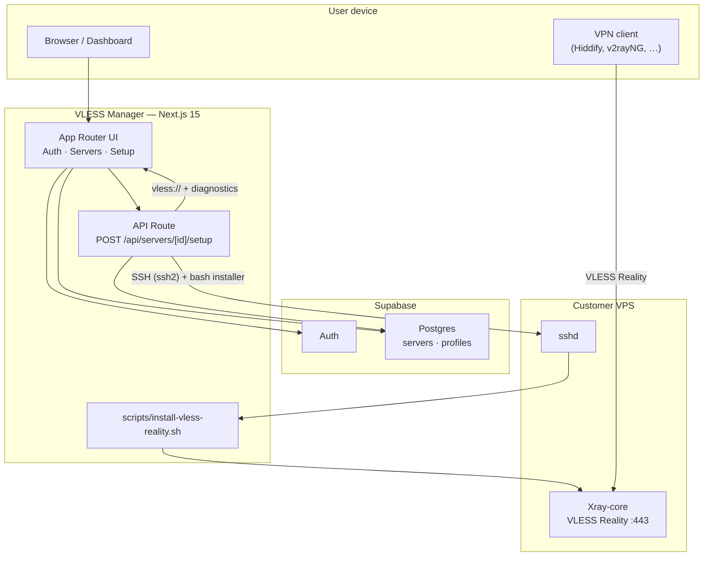

# VLESS Manager

SaaS MVP that turns a bare Linux VPS into a working **VLESS Reality** VPN with one click: add the server in the dashboard, run setup over SSH, get a client-ready `vless://` link and QR code for Hiddify / v2rayNG / Shadowrocket.

> **Note:** the repo / demo domains historically used the name `wg-manager` (WireGuard-era scaffolding). The product installs **Xray VLESS + Reality**, not WireGuard.

**Live demo (Vercel):** [https://wg-manager-pi.vercel.app](https://wg-manager-pi.vercel.app)

**Why it exists:** manual Reality installs (3X-UI panels, key parsing, SNI/port tuning for DPI) are error-prone. VLESS Manager automates the proven recipe — pinned Xray, reachable Reality dest probing, correct `pbk`, BBR — so you ship a connectable config instead of a timeout.

---

## Architecture



**Happy path**

1. User signs up / logs in (Supabase Auth).
2. Adds a VPS (IP, SSH port/password, optional SNI & VLESS port).
3. Opens **Setup VPN** → API connects over SSH and runs the installer.
4. Installer installs Xray **26.3.27**, probes a reachable Reality dest, writes config, enables BBR, prints `VLESS_CONFIG_URL=…`.
5. Dashboard shows the URL + QR; user imports it into a client and connects.

---

## Tech stack

| Layer | Choice |
|-------|--------|
| Framework | **Next.js 15** (App Router) |
| Language | **TypeScript** (`strict: true`) |
| UI | **Tailwind CSS 4**, **shadcn/ui**, Lucide |
| Auth & DB | **Supabase** (`@supabase/ssr` + service role on setup API) |
| Remote install | **Node.js SSH** (`ssh2`) + **Bash** installer |
| Package manager | **pnpm** |

---

## Features (MVP)

- Email/password auth (login, signup, logout) with Supabase session middleware
- Server CRUD in the dashboard (add / list / **delete**)
- One-click **VLESS Reality** setup over SSH
- RU-oriented defaults: port **443**, auto-probed SNI/dest (Cloudflare → Apple → …)
- Pinned **Xray 26.3.27** (avoids broken newer Reality builds)
- Correct Reality `pbk` extraction (`Password` / derived public key — never `Hash32`)
- Setup UI: progress steps, QR code, copyable `vless://` URL, diagnostics panel, retry
- Installation status on the servers table (`pending` / `installing` / `completed` / `error`)
- Helper SQL + diagnostic bash scripts under `scripts/`
- **Buy & setup VPS (Timeweb)** — optional one-click cloud VPS provision + VPN install (MOCK without API token)

---

## Partner model (Timeweb Agent)

**Live demo:** [https://wg-manager-pi.vercel.app](https://wg-manager-pi.vercel.app)

Primary go-to-market is the **Timeweb Agent** referral program (not reseller billing inside the app):

1. User opens **Get VPS via Timeweb** → partner link (`NEXT_PUBLIC_TIMEWEB_PARTNER_URL`, default `https://timeweb.cloud/?i=144829`).
2. At Timeweb they create a cloud server and attach the **platform SSH public key** (`NEXT_PUBLIC_WG_SSH_PUBLIC_KEY`).
3. Back in the app: **Add Server** (IP only, SSH key mode) → **Setup VPN**.
4. Root password is optional (less safe — stored in DB). Prefer SSH key so passwords are not saved.

Cloud API “buy on our balance” (`POST /api/vps/provision`) stays in the codebase as a **technical demo** and is hidden unless `NEXT_PUBLIC_ENABLE_TIMEWEB_API_BUY=true`.

### SSH key setup (operators)

```bash
ssh-keygen -t ed25519 -f wg-manager-deploy -C "wg-manager" -N ""
# public → NEXT_PUBLIC_WG_SSH_PUBLIC_KEY
# private → WG_SSH_PRIVATE_KEY  (in .env use literal \n between PEM lines)
```

Never commit the private key. Rotate if exposed.

### Partner / advertising notes

Follow Timeweb partner rules (no brand-keyword ads, no lookalike domains, no fake registrations). Mark ads as required by local advertising law when you run paid campaigns.

---

## Automatic VPS purchase (Timeweb API — demo)

Product path for passive income / partner flows: user clicks **Buy & setup VPS (Timeweb)** → we create a cloud server via [Timeweb Cloud API](https://timeweb.cloud/docs) → wait until it is `on` → save IP/password → run the existing Reality installer.

### How it works

1. `POST /api/vps/provision` creates the VPS (`POST https://api.timeweb.cloud/api/v1/servers`), polls `GET /api/v1/servers/{id}` until ready, inserts a `servers` row.
2. The dashboard UI then calls the existing `POST /api/servers/[id]/setup` (split on purpose so Vercel timeouts are less likely).
3. Root password is set via `cloud_init` (Timeweb does not reliably return the panel password over API).

### MOCK mode

If `TIMEWEB_CLOUD_API_TOKEN` is empty, provision simulates a 3s delay and returns fake IP/password — **no charges**. Useful for UI demos.

### Env

| Variable | Required | Notes |
|----------|----------|--------|
| `TIMEWEB_CLOUD_API_TOKEN` | for real creates | Bearer token from Timeweb → API and Terraform |
| `TIMEWEB_LOCATION` | no | default `nl-1` (Amsterdam) |
| `TIMEWEB_PRESET_ID` | recommended | pin a known tariff id from `GET /api/v1/presets/servers` |
| `TIMEWEB_OS_ID` | recommended | pin Ubuntu os id (tutorials often use `99`) |

Optional DB columns: run `scripts/timeweb-columns.sql` in Supabase.
For v2 RU Relay columns: run `scripts/relay-columns.sql` in Supabase.

### Partner / revenue note

Timeweb has [partner / agent / reseller programs](https://timeweb.cloud/partners) (referral % or reseller discount). Automating **your own** account API creates servers billed to **you**; end-user markup and partner attribution are a separate product/legal step (referral link on signup vs reseller API). Verify current rates in the partner cabinet — do not rely on unverified percentages.

**Billing UX:** the Buy dialog loads live tariffs from `GET /api/v1/presets/servers` and shows Timeweb’s monthly ₽ plus an estimated **~day** cost (`month ÷ 30`). Timeweb Cloud is typically **hourly**; there is no separate “buy for 1 day pack” in the create-server API — after a test, **delete the VPS** in the Timeweb panel (or via API) to stop charges.

---

## Custom domains (wg-manager.ru / .online)

The app on [https://wg-manager-pi.vercel.app](https://wg-manager-pi.vercel.app) is independent of your custom domains. If `.vercel.app` works but `wg-manager.ru` / `wg-manager.online` do not, the Next.js build is fine — fix **DNS + SSL on Vercel**.

Checklist:

1. Vercel → Project → **Settings → Domains** → add both apex domains (and `www` if needed).
2. At the registrar, set **exactly** what Vercel shows (usually apex `A` → `76.76.21.21`, or the IP Vercel prints; `www` → `CNAME` → `cname.vercel-dns.com` / project-specific target).
3. Remove conflicting old `A` / `AAAA` / `CNAME` records.
4. Wait for status **Valid Configuration**; SSL is issued by Let’s Encrypt after DNS is correct.
5. Supabase Auth → **URL Configuration**: add `https://wg-manager.ru` (and `.online`) to **Site URL** / **Redirect URLs**, otherwise login cookies can break on the custom domain even when the homepage loads.
6. Verify: `nslookup wg-manager.ru` and open the site in an incognito window.

---

## Local setup

### Prerequisites

- Node.js **20+** (22 recommended)
- **pnpm** (`corepack enable && corepack prepare pnpm@latest --activate`)
- A [Supabase](https://supabase.com) project
- A Debian/Ubuntu VPS with root SSH for end-to-end testing

### 1. Clone and install

```bash
git clone <your-repo-url> vpn-saas-mvp-wsl
cd vpn-saas-mvp-wsl
pnpm install
```

### 2. Environment variables

```bash
cp .env.example .env.local
```

Fill in values from the Supabase dashboard (**Project Settings → API**):

| Variable | Where to get it |
|----------|-----------------|
| `NEXT_PUBLIC_SUPABASE_URL` | Project URL |
| `NEXT_PUBLIC_SUPABASE_ANON_KEY` | `anon` `public` key |
| `SUPABASE_SERVICE_ROLE_KEY` | `service_role` key (**secret** — server only) |
| `TIMEWEB_CLOUD_API_TOKEN` | Optional Timeweb API token (empty = MOCK buy-VPS) |

### 3. Database

In the Supabase SQL Editor, create at least a `servers` table used by the app (columns aligned with `src/lib/supabase/types.ts`), with RLS so users only see their own rows (`user_id = auth.uid()`), including `INSERT` / `SELECT` / `UPDATE` / `DELETE`.

Useful follow-ups already in the repo:

```bash
# Optional: tweak column defaults (update to match current product defaults if needed)
# scripts/ru-defaults.sql
# scripts/sni-default.sql
# scripts/timeweb-columns.sql   # provider + provider_server_id
# scripts/relay-columns.sql     # role, exit_server_id, relay_* (v2 Layer 1)
```

Enable **Email** auth in Supabase (**Authentication → Providers**).

### 4. Run the app

```bash
pnpm dev
```

Open [http://localhost:3000](http://localhost:3000) → sign up → **Add Server** → **Setup VPN**.

### 5. Import the client link

1. Delete any old profile for that IP in Hiddify.
2. Import the new `vless://` URL (or scan the QR).
3. Prefer **System Proxy** if TUN fails with permission errors.
4. Confirm connect; if it fails, check setup diagnostics and that the VPS firewall allows the VLESS port (default **443/tcp**).

---

## Project structure (high level)

```
src/
  app/                  # App Router pages + API
  components/           # UI (dashboard, setup, shadcn)
  lib/                  # Supabase clients, constants, types
scripts/
  install-vless-reality.sh   # Production installer used by the API
  add-exit-relay-inbound.sh  # Adds xHTTP Reality inbound on exit (v2)
  install-ru-relay.sh        # RU hop → exit (v2 Layer 1)
  diagnose-fix-reality.sh  # Offline recovery / dest probing
  *.sql                 # Supabase helpers
```

---

## Production notes

- Deploy guide: see [DEPLOY.md](./DEPLOY.md) (Vercel + DNS).
- Never expose `SUPABASE_SERVICE_ROLE_KEY` to the browser.
- SSH passwords are stored in Supabase for setup; treat the DB as sensitive and use RLS.
- Setup can take several minutes (`maxDuration` on the route is elevated); use a host that allows long API runs (or move install to a worker later).
- Rotate any root password that was shared during debugging.
- For RU mobile DPI, Layer 0 Reality may still need a RU relay (Layer 1) on some networks — out of scope for this MVP.

---

## Scripts

| Command | Description |
|---------|-------------|
| `pnpm dev` | Development server |
| `pnpm build` | Production build |
| `pnpm start` | Start production server |
| `pnpm lint` | ESLint |
| `pnpm typecheck` | TypeScript `tsc --noEmit` |
| `bash scripts/publish-github.sh` | Local CI checks + commit + GitHub publish |

---

## Telegram bot (shared VPN)

Friends-and-family VPN bot with manual donations, per-user VLESS keys, and a funnel to the web app.

### Setup

1. Run `scripts/bot-tables.sql` in Supabase SQL Editor.
2. Create a bot via [@BotFather](https://t.me/BotFather).
3. In `.env.local` / Vercel env:
   - `TELEGRAM_BOT_TOKEN`
   - `TELEGRAM_BOT_SERVER_ID` — `servers.id` of your **RU relay** (or exit) with a completed `vless_config_url`
   - `TELEGRAM_BOT_SSH_PASSWORD` — root password for that VPS (server-side only on Vercel, not stored in Supabase)
   - `TELEGRAM_ADMIN_IDS` — your Telegram numeric user id(s), comma-separated
   - `TELEGRAM_DONATE_DETAILS` — SBP / card payment instructions
   - `TELEGRAM_SETUP_SECRET` — random string for one-time webhook registration
4. Deploy, then register webhook:
   ```
   GET https://your-domain.com/api/telegram/set-webhook?secret=YOUR_SETUP_SECRET
   ```
5. Open the bot → `/start` → test donate + admin approve flow.

### Admin commands

| Command | Description |
|---------|-------------|
| `/users` | List bot users and subscription status |
| `/approve <telegram_id>` | Confirm latest pending donation |
| `/revoke <telegram_id>` | Remove Xray client and disable access |
| `/setgoal <rub>` | Set monthly fundraising target |

Per-user UUIDs are added on the VPN server via `scripts/xray-client-manager.sh` over SSH (same credentials as dashboard setup).

---

## License

Private / portfolio MVP — adjust as needed before publishing.
